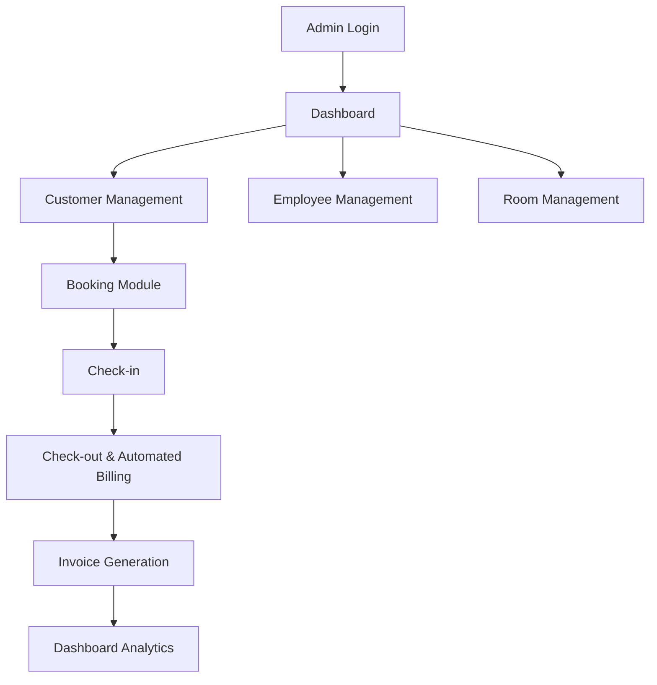
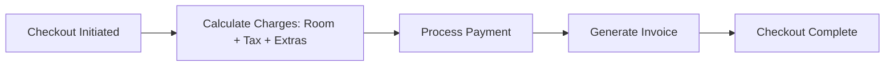

# 🏨 Hotel Management System

A **comprehensive hotel management web application** designed to automate and streamline hotel operations—from managing staff and guests to bookings and billing—all through a centralized dashboard.

---

## 📖 Project Overview

This full-stack application leverages **Node.js**, **Express.js**, and **MySQL**, with a responsive UI crafted using **Bootstrap** and **EJS** templates.

The goal: **Eliminate manual processes and deliver real-time, secure, and accurate hotel management.**

> A robust platform for hotel administrators to manage employees, customers, bookings, and invoices seamlessly.

---

## 🚀 Features

| Category             | Functionality                                                                 |
|----------------------|-------------------------------------------------------------------------------|
| 👥 **Customer Management**   | Add, edit, delete, and search customer information by name or room number         |
| 👨‍💼 **Employee Management**   | Maintain employee records, roles, salaries, and contact details                  |
| 🏠 **Room Management**       | Track available, occupied, and under-maintenance rooms                            |
| 📅 **Bookings**              | Create, modify, and cancel reservations with automated room status updates        |
| 💳 **Billing System**        | Auto-calculate charges (room rent, tax, extras) at checkout                       |
| 🔐 **Authentication**        | Secure login for admins/managers via session-based access                         |
| 📊 **Dashboard Analytics**   | Summaries of bookings, occupancy, and revenue trends                              |

---

## 🧩 Tech Stack

| Layer         | Technology                                 |
|---------------|--------------------------------------------|
| **Frontend**  | HTML5, CSS3, JavaScript, Bootstrap         |
| **Backend**   | Node.js, Express.js                        |
| **Database**  | MySQL (relational schema)                  |
| **Templates** | EJS                                        |
| **Versioning**| Git & GitHub                               |
| **Testing**   | Postman, VS Code                           |

---

## 🧠 Workflow



---

## 🧾 Checkout-to-Billing Flow



---

## 📁 Folder Structure

```
Hotel-Management-Site/
├── app.js                   # Entry point (Express server)
├── package.json             # Dependencies & scripts
├── /config                  # DB configuration
│   └── db.js
├── /controllers             # Business logic
│   ├── customerController.js
│   ├── employeeController.js
│   ├── bookingController.js
│   └── billingController.js
├── /models                  # (Optional ORM models)
│   ├── Customer.js
│   ├── Employee.js
│   └── Booking.js
├── /routes                  # Express routes
│   ├── customerRoutes.js
│   ├── employeeRoutes.js
│   ├── bookingRoutes.js
│   └── billingRoutes.js
├── /views                   # EJS templates
│   ├── home.ejs
│   ├── customers.ejs
│   ├── employees.ejs
│   ├── bookings.ejs
│   ├── billing.ejs
│   └── login.ejs
├── /public                  # Static assets (CSS/JS/images)
│   ├── css/
│   ├── js/
│   └── images/
└── README.md
```

---

## ⚙️ Setup & Installation

1. **Clone the Repository**
    ```bash
    git clone https://github.com/AdishPadalia26/Hotel-Management-Site.git
    cd Hotel-Management-Site
    ```

2. **Install Dependencies**
    ```bash
    npm install
    ```

3. **Setup MySQL Database**

    - Create a database named `hotel_management`.
    - Run the following SQL schema:

    ```sql
    CREATE TABLE customers (
        id INT AUTO_INCREMENT PRIMARY KEY,
        name VARCHAR(100),
        email VARCHAR(100),
        phone VARCHAR(20),
        room_no INT,
        checkin DATE,
        checkout DATE
    );

    CREATE TABLE employees (
        id INT AUTO_INCREMENT PRIMARY KEY,
        name VARCHAR(100),
        role VARCHAR(100),
        salary DECIMAL(10,2)
    );

    CREATE TABLE bookings (
        id INT AUTO_INCREMENT PRIMARY KEY,
        customer_id INT,
        room_no INT,
        checkin DATE,
        checkout DATE,
        total_amount DECIMAL(10,2)
    );
    ```

    - Update `/config/db.js` with your database credentials:
      ```js
      const mysql = require('mysql2');
      const connection = mysql.createConnection({
          host: 'localhost',
          user: 'root',
          password: 'yourpassword',
          database: 'hotel_management'
      });
      module.exports = connection;
      ```

4. **Run the Application**
    ```bash
    npm start
    ```

5. **Visit in Browser**
    ```
    http://localhost:3000
    ```

---

## 💻 Sample Screens (Coming Soon)

<!-- Add screenshots in /screenshots and reference like below -->
<!-- 


 -->

---

## 🔮 Future Enhancements

- 💳 Integrate online payments (Stripe/Razorpay)
- 🧾 Generate PDF invoices
- 🪪 Role-based access control (Admin, Manager, Receptionist)
- 📱 Mobile-friendly UI (React/Flutter frontend)
- 📊 Advanced analytics dashboard

---

## 👨‍💻 Author

**Adish Padalia**  
🎓 MS CS @ Rutgers University | B.Tech (IT) @ SPIT Mumbai  
💼 Full Stack Developer • AI/ML Enthusiast  
📧 padaliaadish@gmail.com  
[GitHub](https://github.com/AdishPadalia26) | [LinkedIn](#) <!-- add your LinkedIn URL -->

---

## 📄 License

This project is open-sourced under the [MIT License](LICENSE).

> “Simplifying hotel operations through automation and smart design.”
